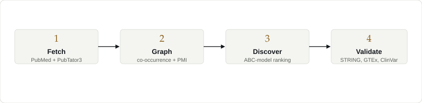
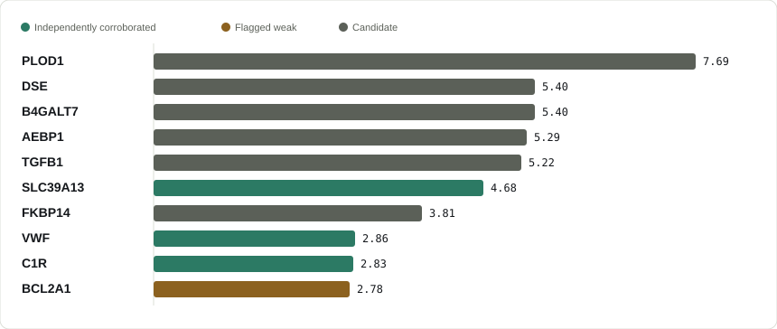

# hEDS Biomarker Discovery


[](https://siguatepeque.github.io/heds-biomarker-discovery/)

A pipeline that reads PubMed for a living. It mines the research literature on
hypermobile Ehlers-Danlos Syndrome (hEDS) looking for genes that show up near the
disease in the writing, without ever being studied in it directly. The output is a
short, ranked list of hypotheses worth a second look. Not a diagnosis, not a test.
A lead list.

**Full write-up:** [siguatepeque.github.io/heds-biomarker-discovery](https://siguatepeque.github.io/heds-biomarker-discovery/)
reads more like a normal article. This README is the developer-facing version.

## Contents

1. [The problem, in plain terms](#the-problem-in-plain-terms)
2. [The theory](#the-theory)
3. [How the robot works](#how-the-robot-works)
4. [What we found](#what-we-found)
5. [The real test](#the-real-test)
6. [What's new here](#whats-new-here)
7. [What backs this up](#what-backs-this-up)
8. [What I decided not to do, and why](#what-i-decided-not-to-do-and-why)
9. [Hey please check this!](#hey-please-check-this)
10. [What this is not](#what-this-is-not)
11. [Running it](#running-it)
12. [Does it actually work?](#does-it-actually-work)

## The problem, in plain terms

hEDS is the one Ehlers-Danlos subtype nobody has a lab test for. You get diagnosed by
checklist: how far your joints bend, which of a long list of other symptoms you have,
whether it runs in your family, and whether a doctor has ruled out everything else it
could be instead. That is the 2017 diagnostic standard, and it is still the standard.
Real genetic leads have started showing up in just the last couple of years (see
[What backs this up](#what-backs-this-up)), but nothing has turned into an actual test
yet.

## The theory

I did not want to build the obvious thing: a classifier trained on symptom checklists,
which just re-learns the diagnostic criteria and calls it a "biomarker." Instead I went
after something nobody seems to have tried for this disease: literature-based
discovery.

It is an old idea. Don Swanson used it in the 1980s to connect fish oil and Raynaud's
disease before anyone had run the clinical trial, just by noticing that both terms kept
showing up near a third concept in completely separate sets of papers. The logic
carries over cleanly here. If hEDS is linked to some phenotype B in the literature, and
B is linked to gene C in a totally different set of papers, but nobody has ever written
a paper connecting hEDS to C directly, then C is worth a look. All of this runs on free,
public data. No lab access required, no patient data touched at any point.

## How the robot works



1. **Fetch** (`fetch_literature.py`). Pulls hEDS and HSD specific papers from PubMed.
   I deliberately left out bare "Ehlers-Danlos syndrome" and other-subtype terms, so
   genes belonging to classical or vascular EDS do not sneak into the corpus. Each
   abstract's genes, diseases, and chemicals get tagged by NCBI's PubTator3 service,
   so I did not have to write my own entity recognizer.
2. **Graph** (`build_graph.py`). Turns all of that into a co-occurrence graph. Two
   concepts get an edge if they show up in the same abstract, weighted by how often,
   plus a PMI score for how surprising that co-occurrence is.
3. **Discover** (`discover_candidates.py`). The actual ABC-model step. Anything
   directly co-mentioned with hEDS in the same abstract is filed as "already studied"
   and set aside. What is left, genes reachable only through a shared bridge concept
   and never directly, gets ranked by an Adamic-Adar score. That score is common
   neighbor math that discounts generic bridge terms (things like "pain," which
   connect to almost everything) more than specific ones. This distinction matters a
   lot. Raw co-occurrence counting alone is a known source of false positives in this
   kind of work, and it bit me twice during development (see [Hey please check
   this](#hey-please-check-this)).
4. **Validate** (`validate_candidates.py`). Before anything makes the final list, it
   gets checked against three independent public sources: STRING (does it physically
   interact with a known hEDS-relevant protein), GTEx (is it actually expressed in
   connective tissue), and ClinVar (does it have any documented variant record at all).
5. Out comes `results/candidates.csv`, usually 10 to 20 genes, each with its evidence
   and a plain language reason it made the list.

## What we found

On the corpus I had while writing this (1,301 abstracts, 1,345 entities, 20,238
co-occurrence edges), the pipeline correctly filed 24 genes as "already studied,"
including COL3A1, COL6A3, SMAD3, and TNXB, and surfaced 10 candidates.



Topping the list is **PLOD1**, which defines kyphoscoliotic EDS. Most of the rest
(AEBP1, DSE, B4GALT7, FKBP14) are similarly genes that define other EDS-spectrum
disorders. That is a reasonable "maybe this whole gene family matters here too"
hypothesis, not individually shocking.

Two entries are worth a closer look on their own merits.

**SLC39A13** sits in the middle of the list. This is the gene from the retrospective
test below, still classified as a candidate today rather than "already studied." More
on that shortly.

**C1R (complement C1r)** independently lines up with a 2025 to 2026 proteomics paper
that found complement-cascade proteins showing up differently in hEDS patients' blood.
I did not point the pipeline at it. It came out of the graph structure on its own, and
it happens to match a completely separate wet-lab finding.

One more worth naming honestly. **VWF (von Willebrand factor)** reaches the list
through a real, coherent bridge concept ("bleedings," a symptom term appearing in 18
real hEDS papers), and bleeding or bruising tendency is a documented hEDS comorbidity.
It has not been directly studied in hEDS by name yet, but the path here is clean, the
same shape as the SLC39A13 case before anyone confirmed it.

Not everything on the list deserves that kind of confidence. **BCL2A1** is here too,
and I think it is mostly noise: low connective-tissue expression (3.5 TPM), reached
only through a chain of classical (not hypermobile) EDS papers, and no clear
biological reason to expect it. I am leaving it in the output because hiding a weak
result is worse than showing one, but it should be read as weak.

ACKR3 and MIA3, two of the newest 2024 to 2025 hEDS genes, do not show up in the
corpus at all yet. That is a data-freshness limit of the underlying literature index,
not a bug in the pipeline.

## The real test

A shortlist is a claim about the future: these are worth a second look. The only
honest way to test that claim is to go back in time. `backtest.py` reruns the exact
same pipeline using only literature published before a chosen cutoff year (the cached
documents each carry their own publication date, so this needs no new network calls),
and checks whether genes that real 2024 to 2025 hEDS genetics later confirmed were
already showing up as candidates before that confirmation existed.

```
python backtest.py --cutoffs 2019 2020 2021 2022 2023 2024 2025 2026
```

Using only papers published through 2021, more than three and a half years before the
first hEDS GWAS meta-analysis went up on medRxiv (19 September 2025), the pipeline
flags SLC39A13 as a candidate through a purely indirect literature path. In September
2025, an independent GWAS meta-analysis (about 1,800 cases, 5,000 controls, a
completely different method: genotyping, not literature) found genome-wide significant
signal at that exact gene.

I did not trust that number on the first pass, and I do not think anyone should trust
a result like this without trying to break it. Getting here took two rounds of finding
real bugs in my own code. The full story, including exactly which papers, which bridge
concepts, and hand-verified arithmetic, is in `results/backtest.txt` and told in full
in the [research paper](https://siguatepeque.github.io/heds-biomarker-discovery/).

One more honest thing, checked just now. SLC39A13 is still classified as a candidate
today, not yet "already studied," even eleven months after the GWAS. Exactly one
document in the whole corpus directly co-mentions hEDS and SLC39A13: the GWAS preprint
itself. No second paper has echoed the connection yet. That is not a weakness in the
method. It is a real, separate observation: the literature index can lag a genuine
discovery by the better part of a year even after publication, which is exactly the
kind of gap a tool like this is positioned to notice.

## What's new here

Before writing any code, I checked whether this had been done. As far as I could find,
nobody has pointed literature-based discovery or knowledge-graph mining at hEDS before.
Not even at neighboring diseases with a similar "diagnosis of exclusion" problem, like
long COVID or fibromyalgia. This angle, at least, seems to be new.

## What backs this up

I did not want to build this in a vacuum, so before writing any code I spent a while
figuring out what had already been tried. Turns out 2024 to 2025 was a genuinely big
couple of years for hEDS genetics, and the reference gene sets baked into
`validate_candidates.py` come from that work, not from other EDS subtypes' better
known genes.

- **KLK gene family**, especially KLK15. A recurrent variant turned up in whole exome
  sequencing of 200 hEDS patients, and it reproduces connective tissue defects when
  reintroduced in mice.
  [Norris Lab, iScience 2025](https://www.ncbi.nlm.nih.gov/pmc/articles/PMC11213194/)
- **ACKR3 and SLC39A13**, the first hEDS GWAS meta-analysis, pointing toward a
  neuroimmune and stromal story rather than a single collagen gene.
  [Petrucci-Nelson et al., medRxiv 2025](https://www.medrxiv.org/content/10.1101/2025.09.19.25336146v1)
- **MIA3**, another 2024 to 2025 candidate, still unresolved.
- **TNXB** (partial deficiency), the oldest lead in this space, though it only
  explains about 1 percent of cases, and serum tenascin-X testing failed as a
  screening tool when people actually tried it. Kept as a weak legacy check.
- **A plasma ECM-fragmentation signature** (fibronectin, collagen-I, and tenascin
  fragments), probably the closest thing to an actual proposed biomarker that exists
  right now, still unvalidated. [Ritelli et al.](https://pubmed.ncbi.nlm.nih.gov/39225014/)
- **The HEDGE Study**, the Ehlers-Danlos Society's own large scale sequencing effort
  covering 1,000 patients, still producing results.

## What I decided not to do, and why

**Clustering patients into subtypes by symptoms.** Already done, and done well. Mayo
Clinic ran K-means and UMAP on more than 2,100 real patients and published real
subtypes. [Petrucci et al. 2024](https://pubmed.ncbi.nlm.nih.gov/38779137/) I do not
have that kind of data, and running the same analysis on something worse would not add
anything.

**Wearables and video-based biomarkers.** Genuinely exciting research: AI-scored
hypermobility from video, wearable heart-rate-variability tracking. Every dataset
behind it is "available on request," not public. That confirmed literature mining was
the right lane for a project built entirely on public data.

**Swapping in SemMedDB** instead of raw co-occurrence. SemMedDB gives semantic
relationships instead of "these two things appeared near each other," which sounds
strictly better. It was deprecated in December 2024 and has not been updated since, so
it would miss both the 2025 GWAS paper and the 2024 KLK15 finding above, and it needs a
UMLS license to even access. Not worth the tradeoff for something meant to stay current
and easy to run.

## Hey please check this!

I would rather tell you exactly what to be skeptical of than let you find it yourself.

- **The VWF finding is new and has only had one pass of scrutiny.** I traced its
  bridge concept and it looks real, but it has not gone through the same two rounds of
  adversarial re-checking that SLC39A13 did. Run `backtest.py` and the graph queries in
  `results/backtest.txt` yourself before repeating this one as settled.
- **BCL2A1 is flagged weak on purpose.** I left it in the shortlist instead of quietly
  dropping it. Read it as "the pipeline's noise floor," not as a finding.
- **The seed-matching patterns in `discover_candidates.py` are a hand-built list.** I
  found and fixed two false positives in that exact list while building this project.
  There could be a third I have not found. If you add a new disease term to the search
  scope, check it against a real, messy abstract before trusting the output.
- **The "already studied" bucket depends entirely on PubTator3's entity tagging being
  right.** It mostly is, but automated tagging makes mistakes, and I have not manually
  audited every one of the 24 genes in that bucket.
- **Run the tests before you trust a change.** `tests/test_build_graph.py` and
  `tests/test_backtest.py` cover the logic that has actually broken before. If you
  touch `discover_candidates.py`, run them first.

## What this is not

This is a hypothesis-generating research tool, not a diagnostic instrument. There is no
confirmed diagnostic biomarker for hEDS in the published literature: not from this
project, not from anyone, not yet. Nothing here should be used to include, exclude, or
otherwise influence an actual diagnosis. At best, a candidate on this list is a
starting point for someone with a lab to look closer.

## Running it

```
python -m venv venv
venv\Scripts\activate
pip install -r requirements.txt

python pipeline.py --top-n 20
```

Most of the runtime is just being polite to free APIs (about 1 request per second),
not actual computation. Figure 10 to 15 minutes for the full corpus. Everything gets
cached under `cache/`, so re-runs are quick unless you pass `--skip-cache`.

Other flags: `--retmax` (how many PubMed results to pull), `--min-weight` (how many
co-occurring abstracts before an edge counts), `--max-bridge-degree` (the hub-node
cutoff), `--top-n` (shortlist size).

## Does it actually work?

- `tests/test_build_graph.py` is a small synthetic-graph test that checks the core
  logic actually separates "directly studied" from "implied but never studied," and
  covers the two seed-matching regressions found during development. No network
  required. Run it with `venv\Scripts\python tests\test_build_graph.py`.
- `tests/test_backtest.py` checks the date-filtering logic behind the retrospective
  validation above.
- On real output, the sanity check is calibrated to what is actually established in
  the literature, not just what is true biologically: TNXB, COL3A1, and COL6A3 should
  land in "already studied" because they are repeatedly, directly co-mentioned with
  hEDS. SLC39A13 is expected to stay a candidate until a second independent paper
  echoes the GWAS finding directly.
- And the one I cannot automate away: read the top candidates yourself. Look at the
  bridge concept connecting them to hEDS and ask whether it is real biology or an
  annotation glitch. This is a hypothesis generator, not an oracle. That check is what
  makes the output mean anything.
