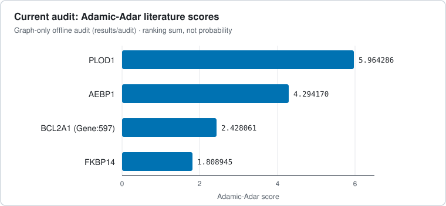
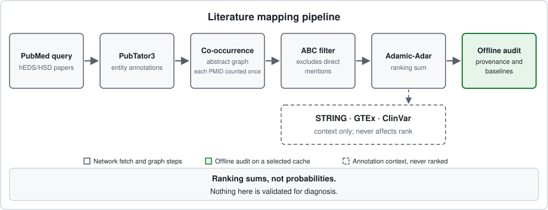

# hEDS Biomarker Discovery

[](https://github.com/Siguatepeque/heds-biomarker-discovery/blob/main/LICENSE) [](https://github.com/Siguatepeque/heds-biomarker-discovery/blob/main/requirements.txt) [](#limits) [](https://siguatepeque.github.io/heds-biomarker-discovery/) [](#offline-evidence-audit)

Abstract-level literature mapping for hEDS/HSD, with ranked candidates and inspectable bridge-paper evidence. Research only, not a diagnostic tool.

An abstract-level literature mapping experiment for hEDS/HSD. It ranks genes
that share bridge concepts with hEDS/HSD and have no detected direct annotated
co-mention in the supplied corpus.

That absence is not evidence of novelty. The output does not identify causal
genes, a single-gene explanation, or a diagnostic biomarker panel. STRING,
GTEx, and ClinVar provide optional context, not validation or ranking points.

> [!WARNING]
> Scores are ranking sums, not probabilities. Nothing here is validated for
> diagnosis, and nothing here establishes causality or novelty.

The [offline audit](#offline-evidence-audit) makes the evidence and simple
baselines inspectable; it does not repair missing biological context automatically.

Read the [research notes](https://siguatepeque.github.io/heds-biomarker-discovery/)
for the evidence review. This file documents the code.

## Contents

- [At a glance](#at-a-glance) > corpus, candidates, scoring, and audit in brief
- [Artifact status](#artifact-status) > which outputs are current and which are archived
- [Current output](#current-output) > headline numbers, ranked genes, and qualifications
- [Method](#method) > fetch, graph, discovery, scoring, annotation, and audit
- [Running it](#running-it) > setup and pipeline
  - [Offline evidence audit](#offline-evidence-audit) > reproducible graph-only audit
- [Backtest (archived, original method)](#backtest-archived-original-method) > retrospective check
- [Fibromyalgia comparison (archived, original method)](#fibromyalgia-comparison-archived-original-method) > control run
- [Limits](#limits) > matching, annotation, and corpus limits
- [Prospective sources, not analyzed](#prospective-sources-not-analyzed) > next measurements to consider
- [Tests](#tests) > offline checks
- [References](#references) > bibliography

## At a glance

| Aspect | Summary |
|---|---|
| Corpus | 1,301 abstracts · 1,345 entities · 20,238 co-occurrence edges |
| Candidates | 4 indirect genes; 132 directly mentioned genes excluded |
| Ranking | Adamic-Adar literature score — a sum, not a probability |
| Annotation | STRING · GTEx · ClinVar lookups; context only, never affects rank |
| Audit | Offline, graph-only, fingerprinted — [`results/audit/`](results/audit/) |

## Artifact status

**Current: graph-only offline audits.**

- [`results/audit/`](results/audit/) is the current full-cache, graph-only audit.
  It includes a fresh graph, Adamic-Adar-ranked candidates, bridge-paper
  provenance, and a fingerprinted report.
- [`results/audit_pre2022/`](results/audit_pre2022/) is the equivalent pre-2022
  retrospective check at k=3.

Neither uses live annotation. These are separate runs, not replacements for or
silent edits to the old snapshots below.

**Archived: annotation snapshot and pre-correction artifacts.**

- [`results/candidates.csv`](results/candidates.csv) is an archived annotation
  snapshot refreshed on 7 September 2026 with the corrected code and live
  STRING/GTEx/ClinVar annotation: 1,301 unique documents, 1,345 entities,
  20,238 edges, 132 directly mentioned genes excluded, 4 indirect candidates.
  SLC39A13, C1R, and VWF are excluded because they have direct mentions.
  Annotation values are live lookups from that date, not fixed constants;
  a rerun can return different STRING/GTEx/ClinVar values. Its composite column
  is historical: current code no longer computes or ranks by that score.
- [`results/graph.graphml`](results/graph.graphml),
  [`results/control_candidates.csv`](results/control_candidates.csv), and
  [`results/control_graph.graphml`](results/control_graph.graphml) remain
  snapshots from before the September 2026 code corrections: left as committed,
  not refreshed.
- [`results/backtest.txt`](results/backtest.txt) and
  [`results/control_backtest.txt`](results/control_backtest.txt) are legacy
  reports. Their cutoff blocks and numeric tables are preserved as run; the
  surrounding interpretation has been revised.

Where behavior differs from the original method, it is described in
[Method](#method).

## Current output

Full corpus: 1,301 abstracts, 1,345 entities, 20,238 co-occurrence edges.
132 genes directly mentioned alongside hEDS/HSD, 4 indirect candidates.

### Ranked candidates

Scores below are Adamic-Adar literature scores from
[`results/audit/candidates.csv`](results/audit/candidates.csv), not the
historical composite scores. Source display names are preserved in the offline
CSV; `Gene:597` is labeled `alpha1` there, and resolved to BCL2A1 in the
archived annotation lookup. No new symbol lookup is performed by the audit.

| Gene | Adamic-Adar | Note |
|---|---|---|
| PLOD1 | 5.964286 | Defines kyphoscoliotic EDS |
| AEBP1 | 4.294170 | Defines classical-like EDS type 2 |
| BCL2A1 (`Gene:597`) | 2.428061 | Context unreviewed; not in the curated differential set |
| FKBP14 | 1.808945 | Defines kyphoscoliotic EDS type 2 |



Bar lengths show Adamic-Adar literature scores from `results/audit/candidates.csv`. Scores are ranking sums, not probabilities.

### Why the list changed

The original 10-candidate snapshot (with DSE, B4GALT7, TGFB1, SLC39A13, VWF,
C1R) is preserved in git history. Those six left the list under the corrected
direct-mention rule. What remains is a gene-family overlap pattern, not a
per-gene finding.

Context for the three excluded entries of interest:

* SLC39A13. The 2025 GWAS meta-analysis (Petrucci-Nelson et al., medRxiv
  2025.09.19.25336146, 1,815 cases and 5,008 controls) reports a
  multi-candidate locus including SLC39A13 and PSMC3: an association, not
  established causality. SLC39A13 was not new to connective-tissue literature:
  it defines a rare recessive EDS subtype and appears near generalized joint
  hypermobility background. See [`results/backtest.txt`](results/backtest.txt).
* VWF. The bridge runs through bleeding/bruising terms, a documented hEDS
  comorbidity. The corpus already holds a 2013 bleeding-clinic paper on
  symptomatic hypermobility (PMID 23030528) and a 2019 review using the phrase
  hypermobile-EDS (PMID 31329366) that the old matcher missed.
* C1R. A 2016 serum study (Watanabe et al., PMID 26709396) directly assayed
  C1R, with western follow-up in JHS/EDS-HT under pre-2017 diagnoses, not the
  2017 hEDS criteria. That paper is already corpus input.

### Qualifications

BCL2A1 has little supporting evidence here. Its 3.5 TPM annotation is not enough
to decide biological relevance. ACKR3 appears in the cached GWAS abstract but
was not an indirect candidate; MIA3 was absent from the cached corpus.
AEBP1's ClinVar record matched on the September 2026 lookup; that value can
change between runs because it is a live keyword search, not a curated label.

## Method



Pipeline stages in order. STRING, GTEx and ClinVar annotations never affect rank, and the audit runs offline on a selected cache directory.

1. Fetch ([`fetch_literature.py`](fetch_literature.py)). Pulls papers matching an
   hEDS/HSD query from PubMed: hEDS-related search results only, not PubMed as
   a whole, with no separate search for papers connecting bridge concepts to
   genes. PubTator3 supplies the entity annotations. Graph and discovery steps
   count each PMID once. Missing annotations leave gaps in the graph, not
   evidence against a gene.
2. Graph ([`build_graph.py`](build_graph.py)). Builds a co-occurrence graph from
   abstracts. Edges carry a co-occurrence weight and a stored PMI value. PMI is
   stored only. Ranking does not use it.
3. Discover ([`discover_candidates.py`](discover_candidates.py)). Applies the ABC
   pattern: genes that share a bridge concept with hEDS/HSD but have no
   detected direct annotated co-mention in this corpus become candidates.
   Matching uses each annotation's own surface text against the alias list in
   that file.
4. Score. Candidates are ranked by Adamic-Adar over bridge nodes: a ranking
   sum, not a probability.
5. Annotate ([`validate_candidates.py`](validate_candidates.py)). Checks each
   candidate against STRING functional associations (can include text mining,
   not guaranteed physical independent interactions), GTEx normal-tissue
   expression in fibroblast, skin, and aorta proxies (not a case-control
   result), and ClinVar keyword match over up to 5 records (a weak signal).
   These annotations never affect rank. Failed or missing lookups remain
   unknown; an unresolved gene symbol does not drop the candidate. Each row
   records the live lookup run time, STRING version, GTEx dataset and
   `annotation_mode=live_unfrozen`, not a frozen API snapshot.
6. Audit ([`audit_literature.py`](audit_literature.py)). Runs offline on an
   explicitly selected cache directory, records both bridge legs and original
   passages for review, and compares retrieval with frequency and known-EDS
   baselines. [`eds_genes.py`](eds_genes.py) flags differential-diagnosis genes
   by Entrez ID without removing them.

### Definitions

* `min_weight` (default 2) is bridge evidence only. A bridge concept needs
  co-occurrence in at least that many seed documents, and a gene-bridge edge
  needs at least that weight. It does not set a novelty threshold.
* Direct-mention exclusion is independent of `min_weight`. Any document that
  co-mentions hEDS/HSD seed text and a gene in the same abstract files that
  gene as directly mentioned. A co-mention does not establish that a paper
  investigated the gene in hEDS. The archived snapshot required at least two
  such documents, which left some previously studied genes on its candidate list.
* Once an eligible bridge admits a candidate, the Adamic-Adar score also counts
  single-document edges to other eligible bridge nodes. That scoring rule is
  unchanged; the two-document floor is an admission rule, not a floor for every
  score contribution.

## Running it

```powershell
python -m venv venv
venv\Scripts\activate
pip install -r requirements.txt

python pipeline.py --top-n 20
```

On macOS/Linux, use `source venv/bin/activate` in place of
`venv\Scripts\activate`.

The scripts pause between API calls. Runtime depends on corpus size and service
availability. PubTator responses are cached under `cache/`; search and candidate
annotation still use the network. Pass `--skip-cache` to refetch PubTator data.

### Offline evidence audit

With a populated hEDS-specific `cache/` directory:

```powershell
python audit_literature.py
python audit_literature.py --cutoff 2022 --top-n 3 --output-dir results/audit_pre2022
```

`--cache-dir` selects a directory of `pubtator_*.json` document lists. The audit
does not search PubMed, fetch missing records, resolve symbols, or call annotation
APIs. Do not mix control-disease batches into that directory: cache filenames do
not establish disease-query membership. Empty input, malformed records, and
conflicting versions of the same PMID fail rather than silently selecting one.

Each output directory contains:

* `candidates.csv`: **all** admitted candidates in AA order, document frequency,
  baseline ranks and an other-EDS differential flag. Blank flag means not in the
  curated set, not absence of other-disease relevance. `--top-n` sets metric k only.
* `evidence.json`: each scored bridge's seed-document IDs (A-B), gene/bridge
  document IDs (B-C), degree and contribution, plus the referenced passages and
  annotations. `admission_edge=false` identifies single-document edges that
  contribute after another edge admits the candidate. All context is unreviewed.
* `graph.graphml`: a graph from the same effective corpus as the CSV.
* `report.json`: input/effective corpus hashes, input-file and code hashes,
  output hashes, document IDs, date gaps, parameters, environment versions,
  complete baseline rankings and target retrieval. Alternate KLK15 records share
  one target denominator entry. No-seed cutoffs are untestable, not specificity successes.

Before 2022 the audit retains 733 documents; 4 input documents have missing or
invalid dates and cannot enter a dated cutoff. Full-cache target recall is 0/4
for all three rankings, but there are **zero eligible target groups**: three are
directly mentioned and MIA3 is absent. This is not a prospective recall estimate.

The fingerprints allow checking which inputs/code produced these files and
detecting mixed artifacts. The full input cache is not committed; hashes alone
cannot reconstruct missing abstracts. Keep the exact cache to reproduce a run.
Live annotation rows remain unfrozen; their timestamps do not solve API drift.

After fetching a corpus, run the graph-only backtest without network calls:

```powershell
python backtest.py --cutoffs 2019 2020 2021 2022 2023 2024 2025 2026
```

Flags: `--retmax` (PubMed result count), `--min-weight` (bridge evidence
floor), `--max-bridge-degree` (hub-node cutoff), `--top-n` (shortlist size).

`pipeline.py --top-n` means shortlist size, while `audit_literature.py --top-n`
means metric k only.

The September review ran on the existing Python 3.12.6 environment.
`requirements.txt` retains the original pins; that pinned environment was not
reinstalled during this review.

## Backtest (archived, original method)

[`backtest.py`](backtest.py) reruns discovery on papers dated before each cutoff
year. Full cutoffs and bug history are preserved in
[`results/backtest.txt`](results/backtest.txt).

Archived headline numbers under the original method, papers before 2022: 733
documents, 8 candidates, SLC39A13 at rank 8 with Adamic-Adar 0.860365.
The corrected offline run uses the same 733 dated documents and retrieves
SLC39A13 at rank 3 of 3, still scoring 0.860365. It has no matched direct mention
in that subset. The smaller list reflects stricter exclusions, not new evidence.

The code and target list were developed after the GWAS was known. This checks
retrospective retrieval, not prospective prediction. The new offline audit adds
simple baselines over all non-directly-mentioned graph genes, not just ABC survivors.
Before 2022, SLC39A13 ranks 3 by ABC, 4 by document frequency, and 3 by the
known-EDS frequency baseline. At k=3, ABC and known-EDS each retrieve 1/4 target
groups; frequency retrieves 0/4. This does not demonstrate an advantage over
known-EDS shortlisting. The target list, differential set and this comparison are
post hoc, not preregistered or historically frozen.

| Ranking (pre-2022, k=3) | Target groups retrieved |
|---|---|
| ABC (Adamic-Adar ranking) | 1/4 |
| Document frequency | 0/4 |
| Known-EDS frequency | 1/4 |

> [!NOTE]
> Retrospective retrieval is post hoc. At k=3, ABC and the known-EDS baseline
> each retrieve 1/4 target groups, so no advantage over known-EDS shortlisting
> is demonstrated.

The GWAS preprint itself (PMID 41001447) is the single direct co-mention of
hEDS/HSD seed text with SLC39A13 in the full corpus. The original method kept
SLC39A13 as a candidate because direct filing then required two documents:
a threshold effect, not an indexing-delay finding. No claim is made of first
use of literature-based discovery in neighboring diseases.

## Fibromyalgia comparison (archived, original method)

[`control_disease.py`](control_disease.py), [`controls.py`](controls.py), and
[`control_backtest.py`](control_backtest.py) run the same pipeline for
fibromyalgia with swapped query and seed terms. Details and the full cutoff
table are preserved in
[`results/control_backtest.txt`](results/control_backtest.txt).

The 8 fibromyalgia GWAS targets (Kerrebijn et al., medRxiv 2025.09.18.25335914,
published Nat Med 2026) are never candidates at any cutoff. That is a
coverage and recall limit, not proof of specificity. Before 2020 the control
corpus holds 1 document, so early cutoffs test almost nothing. The archived
control run lists 6 candidates (Nfe2l2, Bax, S100A7, PPARGC1A, Myog, IL23A),
none matching the 8 GWAS targets or the older set (GCH1, COMT, OPRM1). The
oxidative-stress theme across some of them shows the failure mode: a large
non-genetic literature can clear the bridge filter and look identical in
structure to a genetic bridge.

## Limits

* Seed matching depends on an alias list and PubTator3 annotations. A paper
  comparing several EDS subtypes can co-mention genes from another subtype.
  hEDS, HSD and legacy JHS/EDS-HT mentions are pooled, not adjudicated into
  diagnostically equivalent cohorts. No automatic species/negation/mechanism
  filter or expert evidence review has been added.
* STRING, GTEx, and ClinVar supply annotations rather than required pass/fail
  filters. Code tests do not establish biological or diagnostic validity.
* The backtest filters publication dates in today's cache, not a historical
  snapshot of PubMed. Search limits, missing papers, and changed annotations
  can affect which connections are available at each cutoff.

## Prospective sources, not analyzed

These datasets provide a next step beyond literature ranking. Their measurements
have not been reanalyzed in this repository.

* Griggs et al. 2025, 29 hEDS plus 29 matched controls, mass spectrometry,
  [PRIDE PXD062941](https://www.ebi.ac.uk/pride/archive/projects/PXD062941), expanded
  ELISA 41 plus 38 (not automatically independent).
  No replication of the disease-specific ECM-fragment pattern of Ritelli et
  al. doi 10.1002/ajmg.a.63857. doi 10.1093/immhor/vlaf044, PMC12448790.
* Cinquina et al. 2026, 88 hEDS plus 88 HSD plus 176 controls, Olink, public
  NPX supplements. Reported no significant hEDS/HSD difference (not
  equivalence). C1R and VWF not measured. Some US patients, all controls
   Italian. The paper reports plate randomization and no DEPs in Italy-US patient
   comparisons; site effects are not wholly unaddressed, but US controls are absent.
   doi 10.1186/s12014-026-09588-2, PMC13081554. Start with a within-Italy
   comparison to assess residual collection-site effects; check participant overlap before
  calling agreement between studies independent replication.

## Tests

Each check runs directly without network access:

```powershell
venv\Scripts\python tests\test_build_graph.py
venv\Scripts\python tests\test_backtest.py
venv\Scripts\python tests\test_controls.py
venv\Scripts\python tests\test_validate_candidates.py
venv\Scripts\python tests\test_site.py
venv\Scripts\python tests\test_audit_literature.py
```

* `test_build_graph.py` checks single-mention exclusion, seed aliases, subtype
  exclusions, and duplicate-document invariance.
* `test_backtest.py` checks cutoff date filtering, including that undated
  documents never pass.
* `test_controls.py` checks that hEDS and control seed patterns do not
  cross-match and that the control swap restores hEDS config.
* `test_validate_candidates.py` distinguishes missing API data from negative
  results, checks that unresolved candidates remain, and proves annotations cannot
  change rank or silently drop differential-diagnosis genes.
* `test_site.py` checks page anchors, table headers, and the static HTML structure.
* `test_audit_literature.py` checks provenance and score sums, baseline universes,
  target denominators, date filtering, conflicting cache records, empty/no-seed
  results and deterministic artifact regeneration.

## References

1. Petrucci-Nelson T, Guilhaumou S, Berrandou T-E, et al. Complex Genetics and
   Regulatory Drivers of Hypermobile Ehlers-Danlos Syndrome: Insights from
   Genome-Wide Association Study Meta-analysis. medRxiv. 2025 Sep 21. Preprint.
   doi:[10.1101/2025.09.19.25336146](https://doi.org/10.1101/2025.09.19.25336146)
2. Gensemer C, Petrucci T, Beck T, et al. KLK15 alters connective tissues in
   hypermobile Ehlers-Danlos syndrome. iScience. 2025;28(9):113343.
   doi:[10.1016/j.isci.2025.113343](https://doi.org/10.1016/j.isci.2025.113343)
3. Ritelli M, Chiarelli N, Cinquina V, et al. Bridging the Diagnostic Gap for
   Hypermobile Ehlers-Danlos Syndrome and Hypermobility Spectrum Disorders: Evidence
   of a Common Extracellular Matrix Fragmentation Pattern in Patient Plasma as a
   Potential Biomarker. Am J Med Genet A. 2025 Jan.
   doi:[10.1002/ajmg.a.63857](https://doi.org/10.1002/ajmg.a.63857)
4. Petrucci T, Barclay SJ, Gensemer C, et al. Phenotypic Clusters and Multimorbidity
   in Hypermobile Ehlers-Danlos Syndrome. Mayo Clin Proc Innov Qual Outcomes. 2024 Jun.
   doi:[10.1016/j.mayocpiqo.2024.04.001](https://doi.org/10.1016/j.mayocpiqo.2024.04.001)
5. Kerrebijn I, et al. The genetic architecture of fibromyalgia across 2.5
   million individuals. medRxiv. 2025 Sep 19. Preprint.
   doi:[10.1101/2025.09.18.25335914](https://doi.org/10.1101/2025.09.18.25335914).
   Published: Nat Med. 2026 Jul 28. doi:[10.1038/s41591-026-04492-6](https://doi.org/10.1038/s41591-026-04492-6)
6. Watanabe et al. 2016. Serum study that directly assayed C1R, with western
   follow-up in JHS/EDS-HT under pre-2017 diagnoses. PMID 26709396.
   doi:[10.3892/ijmm.2015.2437](https://doi.org/10.3892/ijmm.2015.2437)
7. Bleeding-clinic study of symptomatic hypermobility. 2013. PMID 23030528.
   doi:[10.1111/hae.12020](https://doi.org/10.1111/hae.12020)
8. Review using the phrase hypermobile-EDS. 2019. PMID 31329366.
   doi:[10.1111/hae.13800](https://doi.org/10.1111/hae.13800)
9. Griggs et al. 2025. 29 hEDS and 29 matched controls, mass spectrometry,
   PRIDE PXD062941, expanded ELISA 41 and 38.
   doi:[10.1093/immhor/vlaf044](https://doi.org/10.1093/immhor/vlaf044).
   PMC12448790.
10. Cinquina et al. 2026. 88 hEDS, 88 HSD, 176 controls, Olink.
    doi:[10.1186/s12014-026-09588-2](https://doi.org/10.1186/s12014-026-09588-2).
    PMC13081554.
